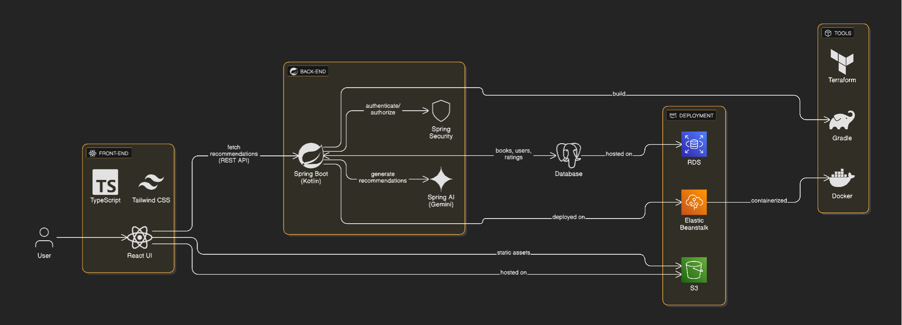

# PageMatch

PageMatch is a full-stack book recommendation engine that delivers personalized book suggestions using AI, built with Spring Boot (Kotlin), Spring AI, React, PostgreSQL, and AWS. The app processes a small set of Goodreads data to recommend books based on user ratings and preferences (e.g., "You loved *1984*; try *Brave New World*"). It features a responsive React UI, secure OAuth2 APIs, and efficient data handling.

## Features
- **Personalized Recommendations**: Uses Spring AI (Google Gemini) to generate book suggestions based on user ratings and genres.
- **Responsive UI**: React/TypeScript front-end login, recommendation generation, user profiles, recommendation feed
- **Secure APIs**: OAuth2 (Auth0) protects user data, aligning with cybersecurity demands
- **Scalable Backend**: Spring Boot (Kotlin) with PostgreSQL

## Tech Stack
- **Front-End**: React, TypeScript, Tailwind CSS, Chart.js
- **Back-End**: Spring Boot (Kotlin), Spring AI (Gemini), Spring Security (OAuth2)
- **Database**: PostgreSQL
- **Deployment**: AWS (Elastic Beanstalk, S3, RDS)
- **Tools**: Docker, Gradle, Auth0

## Architecture

- **React UI**: Fetches recommendations via secure REST APIs.
- **Spring Boot**: Handles business logic, integrates Gemini for AI recommendations.
- **PostgreSQL**: Stores books, users, and ratings with optimized queries.
- **AWS/Render**: Deploys backend (Beanstalk), front-end (S3), and database (RDS).

## Setup Instructions
### Prerequisites
- Docker, Docker Compose
- Gradle 8.10+
- Auth0 account (free tier)
- Optional: AWS account, Hugging Face API token

### Local Development
1. Clone the repo:
   ```bash
   git clone https://github.com/josh-janes/pagematch-backend.git
   cd pagematch-backend

2. Start PostgreSQL and Spring Boot:
   ```bash
    docker-compose up

3. Seed mock Goodreads data (5,000 books, 10,000 ratings):
   ```bash
    python scripts/seed_data.py

4. Run front-end:
   ```bash

    cd ../pagematch-frontend
    npm install
    npm start

Access the app at http://localhost:3000 (React) and http://localhost:8080/api (Spring Boot).